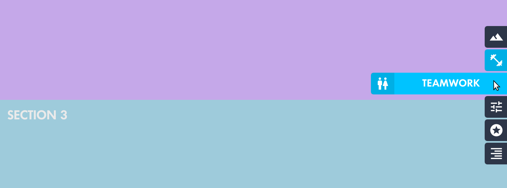

overwatch-side-nav
=========

A React component modeling the [Official Overwatch website side-navigation](https://web.archive.org/web/20171214184846/https://playoverwatch.com/en-us/game/overview/).

## Install

	npm install --save overwatch-side-nav

### Fonts

#### Futura No 2 D DemiBold

This font is used by Activision Blizzard for much of Overwatch's design. For this component **to match the Overwatch design, including the font is required**. It can be licensed from [MyFonts](http://www.myfonts.com/fonts/urw/futura-no-2/futura-no2-d-demi-bold/).

When using CSS font-face, the font-family should match whats below:

    font-family: 'Futura No 2 D DemiBold';
    
## Usage

Check out [example/index.js](example/index.js) for working example or below for exact usage.

    import SideNav from 'overwatch-side-nav'

    import SVG_MATERIAL_CHEVRON from 'svg-icon/dist/svg/material/chevron-left.svg'
    
    const items = [
        {
            label: 'Home',
            id: 'top',
            icon: SVG_MATERIAL_CHEVRON,
        },
        {
            label: 'Highlights',
            id: 'potg',
            icon: SVG_MATERIAL_CHEVRON,
        },
        {
            label: 'Settings',
            id: 'settings',
            icon: SVG_MATERIAL_CHEVRON,
        },
    ]
    
    class Example extends React.Component {

        render() {    
            return <SideNav
                items={items}
            />
        }
    }

### Props

| name        | required | type           | default  | desc 
--- |--- | --- | --- | --- |
| items | **`X`** | array | null | Array of objects, with required keys `id`, `label`, and `icon` |
| &nbsp;*item*.**label** | **`X`** | string | null | Label for the navigation item, displayed in uppercase |
| &nbsp;*item*.**id** | **`X`** | string | null | HTML id for the navigation item. The item will be shown as active when `id` is same as `window.location.hash` |
| &nbsp;*item*.**icon** | **`X`** | `<svg>` | null | Icon for the navigation, positioned to the left of the label. Must be a valid SVG |
| defaultColor | | string | #323C50 | Background color for navigation items that aren't active. Should visually contrast `textColor` |
| activeColor | | string | #FFFFFF | Background color for the active navigation item |
| textColor | | string | #00C3FF | Color for the navigation items' `label` and the fill color for the `icon` SVG |
| zIndex | | number | 1000000 | CSS `z-index` for the navigation. Used with `position: fixed`, to float SideNav above (or below) the page |

## Development

    npm run dev
  
#### Running the example

Install it:

    cd example/; npm install
    
Run it while developing (in another terminal window):

    cd example/; npm run dev
    
    
Open [http://localhost:8080/](http://localhost:8080/) to see the running example

## Tests

    npm test

### License

Made with 🍊 by [Chris Dolphin](https://github.com/likethemammal)

#### Fonts

The font **Futura No 2 D DemiBold** should be licensed through [MyFonts.com](http://www.myfonts.com/fonts/urw/futura-no-2/futura-no2-d-demi-bold/)
